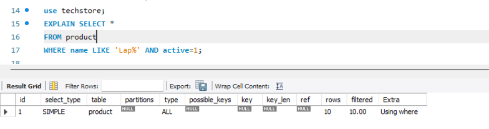
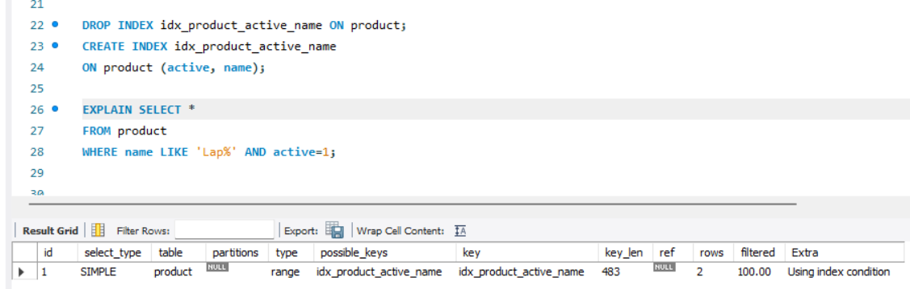

# Resumen de Vistas, Índices y Permisos de usuario.

## **Índices**

Los índices en MySQL permiten localizar y devolver registros de una forma sencilla y rápida. Son especialmente útiles cuando queremos buscar elementos de entre los millones y hasta billones de registros que puede contener una tabla en un momento dado. Cuando no usamos índices, a veces podemos percibir que MySQL tarda demasiado en responder una consulta.


Piensa en un índice como en “algo que te ayuda a encontrar cosas rápido”.
Imagina un libro enorme (la tabla) con miles de páginas (filas):
	Sin índice: si quieres encontrar “la palabra Laptop”, tienes que leer página por página hasta hallarla. Eso es lento.
	Con índice: el libro tiene un índice al final que te dice:
		“Laptop → página 312”.
	Entonces vas directo. 

En MySQL pasa igual:
	La tabla guarda los datos.
	El índice es una estructura extra (como un “mapa”) que permite ir directo a las filas sin revisar todas.

En este ejemplo de aqui, sin indice, la select recorre todas las filas (10 row):



Se pone active primero porque un índice compuesto funciona de izquierda a derecha: MySQL filtra primero por active y luego por name.
Conviene ese orden solo si active=1 reduce mucho las filas o si casi todas las consultas filtran por activos; si no, suele rendir mejor name primero.




## Ejercicios de Índices

Haciendo uso de la BD `techstore` resuelve:

**Ejercicio B1:**

La empresa consulta frecuentemente pedidos de un cliente en un rango de fechas:
        `customer_id = ? AND created_at BETWEEN ? AND ?`
Propón y crea el/los índices adecuados (justifica con comentario). 

<details><summary>Mostrar Solución</summary>

```sql
use techstore;
CREATE INDEX idx_orders_customer_createdat 
ON orders (customer_id, created_at); 
```
Para una consulta del tipo `WHERE customer_id = ? AND created_at BETWEEN ? AND ?` lo mejor es un índice compuesto por `customer_id` y `created_at`, porque `customer_id = ?` es una condición de igualdad entonces conviene que sea la primera columna del índice. `created_at BETWEEN ...` es un rango lo mejor escolocarlo después ya que asi, el índice primero acotar por cliente y luego recorrer solo el rango de fechas.

</details>

**Ejercicio B2:**
Se filtran tickets por estado y prioridad constantemente:
        `WHERE status=? AND priority=? ORDER BY created_at DESC`
Propón y crea el índice más adecuado. 

<details><summary>Mostrar Solución</summary>

```sql
CREATE INDEX idx_ticket_status_priority_createdat
ON ticket (status, priority, created_at); 
```
Para una consulta del tipo `WHERE status=? AND priority=? ORDER BY created_at DESC` lo mejor es un índice compuesto las columnas de igualdad y al final la columna usada para ordenar.

</details>

**Ejercicio B3:**
Se buscan productos por nombre usando prefijo:
        `WHERE name LIKE 'Lap%' AND active=1`
Crea el índice adecuado (puede ser compuesto y/o de prefijo).

<details><summary>Mostrar Solución</summary>

```sql
DROP INDEX idx_product_active_name ON product;
CREATE INDEX idx_product_active_name
ON product (active, name); 
```

El índice más adecuado es compuesto completo, con `active` primero y `name` después para aprovechar: `active=1` (igualdad) → primera columna y  `name LIKE 'Lap%'` (prefijo → rango) → segunda columna
</details>

---

## **Administración de Usuarios**

En una empresa, no todo el mundo debe poder hacer de todo en la base de datos:
Por ejemplo un trabajador de soporte no debería crear pedidos ni modificar productos.

Esto se llama principio de mínimo privilegio:
>	“Dale a cada usuario solo lo que necesita para hacer su trabajo… y nada más.”
    
Un rol es como un `pack de permisos` con nombre, por ejemplo:
	r_catalog_read = “puede ver catálogo”
	r_orders_create = “puede crear pedidos”

Cuando haces `CREATE ROLE`, el rol nace *vacío*, sin permisos. Los permisos se *otorgan* después con `GRANT ... TO rol`.

## Ejercicios Administración de Usuarios

Tenemos los siguientes usuarios del sistema para la BD `techstore`:
   - dev_app: desarrollador (necesita leer todo y poder insertar pedidos/items y tickets)
   - sales_user: comercial (solo lectura de catálogo público + puede crear pedidos e items)
   - support_user: soporte (solo lectura de datos de clientes necesarios + gestión de tickets)
   - auditor: solo lectura de reports (vistas) y nada más
   - admin_nogrant: admin total del servidor pero SIN posibilidad de dar privilegios
   - superadmin: admin total con posibilidad de dar privilegios

Tareas:
   - Crea roles adecuados (mínimo 4 roles) y asigna permisos mínimos necesarios.
   - Crea los usuarios y asígnales roles.
   - Incluye pruebas:
       - un SELECT permitido y uno prohibido para sales_user
       - un INSERT permitido y uno prohibido para support_user
       - SHOW GRANTS para auditor


1) Crear roles (sin permisos)
<details><summary>Mostrar Solución</summary>

```sql
CREATE ROLE r_catalog_read;
CREATE ROLE r_orders_create;
CREATE ROLE r_customers_read_support;
CREATE ROLE r_tickets_manage;
CREATE ROLE r_reports_read;
CREATE ROLE r_dev_read_all;
```

</details>

 2) “Cargar” permisos dentro de cada rol 
   
<details><summary>Mostrar Solución</summary>

```sql
-- r_catalog_read: SOLO ver catálogo (category/product)
GRANT SELECT ON techstore.category TO r_catalog_read;
GRANT SELECT ON techstore.product  TO r_catalog_read;

-- r_orders_create: crear pedidos (orders) y líneas (order_item)
GRANT SELECT, INSERT ON techstore.orders     TO r_orders_create;
GRANT SELECT, INSERT ON techstore.order_item TO r_orders_create;

-- r_customers_read_support: soporte lee SOLO columnas necesarias de customer
GRANT SELECT (id, dni, full_name, city, email, phone)
ON techstore.customer TO r_customers_read_support;

-- r_tickets_manage: gestionar tickets (ver, crear, actualizar)
GRANT SELECT, INSERT, UPDATE ON techstore.ticket TO r_tickets_manage;

-- r_reports_read: auditor SOLO puede leer vistas de reportes
GRANT SELECT ON techstore.v_orders_total_by_customer   TO r_reports_read;
GRANT SELECT ON techstore.v_tickets_by_status_priority TO r_reports_read;

-- r_dev_read_all: dev puede leer TODO techstore
GRANT SELECT ON techstore.* TO r_dev_read_all;
```

</details>

 3) Creamos usuario y asignamos rol o roles
   
<details><summary>Mostrar Solución</summary>

```sql
/* ---------------- dev_app: desarrollador ----------------
   Necesita: leer todo + insertar pedidos/items + insertar/gestionar tickets
*/
CREATE USER 'dev_app'@'%' IDENTIFIED BY 'DevApp_123!'; -- Creamos el usuario del desarrollador
GRANT r_dev_read_all, r_orders_create, r_tickets_manage, r_catalog_read TO 'dev_app'@'%'; -- Le asignamos roles ya “cargados” con permisos.


/* ---------------- sales_user: comercial ----------------
   Necesita: lectura del catálogo + crear pedidos e items
*/
CREATE USER 'sales_user'@'%' IDENTIFIED BY 'Sales_123!'; -- Creamos el usuario comercial
GRANT r_catalog_read, r_orders_create TO 'sales_user'@'%';
-- Le asignamos:
-- - r_catalog_read  -> ver productos/categorías
-- - r_orders_create -> crear pedidos y sus líneas


/* ---------------- support_user: soporte ----------------
   Necesita: leer datos mínimos de clientes + gestión de tickets
*/
CREATE USER 'support_user'@'%' IDENTIFIED BY 'Support_123!'; -- Creamos el usuario de soporte
GRANT r_customers_read_support, r_tickets_manage TO 'support_user'@'%';
-- Le asignamos:
-- - r_customers_read_support -> leer SOLO columnas necesarias de customer
-- - r_tickets_manage         -> crear/ver/actualizar tickets

/* ---------------- auditor: auditoría ----------------
   Necesita: solo lectura de reportes (vistas) y nada más
*/
CREATE USER 'auditor'@'%' IDENTIFIED BY 'Audit_123!'; -- Creamos el usuario auditor
GRANT r_reports_read TO 'auditor'@'%';
-- Le asignamos:
-- - r_reports_read -> SELECT únicamente sobre vistas de reportes (v_...)

/* ---------------- admin_nogrant: admin sin delegar permisos ----------------
   Necesita: admin total del servidor pero SIN poder dar privilegios a otros
*/
CREATE USER 'admin_nogrant'@'%' IDENTIFIED BY 'AdminNoGrant_123!'; -- Creamos el usuario admin sin delegación
GRANT ALL PRIVILEGES ON *.* TO 'admin_nogrant'@'%';
-- Admin total, PERO sin WITH GRANT OPTION -> no puede conceder permisos a otros

/* ---------------- superadmin: admin con delegación ----------------
   Necesita: admin total del servidor CON poder dar privilegios a otros
*/
CREATE USER 'superadmin'@'%' IDENTIFIED BY 'SuperAdmin_123!'; -- Creamos el superadmin
GRANT ALL PRIVILEGES ON *.* TO 'superadmin'@'%' WITH GRANT OPTION;
-- Admin total + WITH GRANT OPTION -> sí puede conceder permisos a otros
```
</details>

## **Vistas**

Una vista se puede entender como una consulta de selección almacenada en el sistema bajo un nombre, que permite ser ejecutada directamente a través de ese nombre. Al definir una vista creamos una tabla virtual, es decir, una tabla que no almacena datos propios sino que muestra datos almacenados en otras tablas.

Hay que tener en cuenta que realmente la consulta que se ha creado como vista no se encuentra almacenada sino que tiene que ser generada cada vez que se deba utilizar.

Cuando creamos una vista a partir de una consulta sobre una o más tablas, las futuras modificaciones en las tablas no se propagarán a la vista; si se añaden columnas a las tablas no se mostrarán en la vista, y si se eliminan columnas de las tablas que aparecían en la vista, la ejecucón dará un error.

Resumiendo: 
- Una `tabla` guarda datos.
- Una `vista` **NO** guarda datos, guarda el SELECT.
- Cada vez que consultas la vista, MySQL ejecuta ese SELECT.
  

## Ejercicios de Vistas

1) La empresa quiere un *panel de ventas* para el equipo comercial.
   Crea una vista `v_sales_orders` que muestre SOLO pedidos con estado `PAID` y:
        - id_pedido, fecha (created_at)
        - cliente (full_name, city)
        - comercial (employee.full_name)
        - total_pedido (SUM(qty*unit_price))
   Orden natural: por fecha desc (la vista no ordena, pero la consulta de prueba sí).
   Incluye una consulta de prueba usando la vista.

<details><summary>Mostrar Solución</summary>

```sql
CREATE OR REPLACE VIEW v_sales_orders AS
SELECT
  o.id AS id_pedido,
  o.created_at AS fecha,
  c.full_name AS cliente,
  c.city AS ciudad,
  e.full_name AS comercial,
  SUM(oi.qty * oi.unit_price) AS total_pedido
FROM orders o  -- Se parte de orders porque es la “cabecera” del pedido.
JOIN customer c    ON c.id = o.customer_id -- Se une customer para nombre/ciudad
JOIN employee e    ON e.id = o.employee_id -- employee para el comercial
JOIN order_item oi ON oi.order_id = o.id -- order_item para calcular el total
WHERE o.status = 'PAID' -- Filtramos WHERE o.status='PAID' para que solo salga lo cobrado.
GROUP BY  -- GROUP BY es obligatorio porque estamos usando SUM (agregación): queremos una fila por pedido.
  o.id, o.created_at,
  c.full_name, c.city,
  e.full_name;
  
/* La vista no “ordena” el orden lo pones en la consulta que use la vista.*/  
/* Consulta de prueba */
SELECT *
FROM v_sales_orders
ORDER BY fecha DESC;
```
</details>


2) El equipo de soporte necesita ver tickets con datos del cliente.
   Crea una vista `v_support_tickets` que muestre:
        - ticket_id, created_at, status, priority, subject
        - customer.full_name, customer.email, customer.phone
        - assigned_employee (username o nombre; si no hay asignado, que salga NULL)
   Incluye una consulta de prueba filtrando por status='OPEN'.

<details><summary>Mostrar Solución</summary>

```sql
CREATE OR REPLACE VIEW v_support_tickets AS
SELECT
  t.id AS ticket_id,
  t.created_at,
  t.status,
  t.priority,
  t.subject,
  c.full_name AS customer_full_name,
  c.email     AS customer_email,
  c.phone     AS customer_phone,
  e.username  AS assigned_employee
FROM ticket t -- Base: ticket t (es lo que se quiere listar).
JOIN customer c -- porque todo ticket tiene cliente (customer_id es NOT NULL).
  ON c.id = t.customer_id
LEFT JOIN employee e -- porque assigned_employee_id puede ser NULL. Si usáramos JOIN normal, se perderían los tickets sin asignar.
  ON e.id = t.assigned_employee_id;


/* Consulta de prueba: solo tickets OPEN */
SELECT *
FROM v_support_tickets
WHERE status = 'OPEN'
ORDER BY created_at DESC;
```

</details>

3) La empresa quiere un resumen del inventario por producto, sin calcular el stock final.
   Crea una vista llamada `v_stock_summary´ que muestre:
     - product_id, sku, product_name, category, active
     - total_movimientos: número total de movimientos registrados para ese producto (COUNT)
     - unidades_totales_movidas: suma total de unidades movidas (SUM(qty))
   Importante:
     - Deben aparecer también los productos que NO tengan movimientos.
     - En esos productos, total_movimientos debe ser 0.
     - unidades_totales_movidas puede quedar NULL si no hay movimientos (comportamiento normal de SUM).
   Incluye una consulta de prueba que muestre los 5 productos con MENOS movimientos.

<details><summary>Mostrar Solución</summary>

```sql
CREATE OR REPLACE VIEW v_stock_summary AS
SELECT
  p.id   AS product_id,
  p.sku,
  p.name AS product_name,
  c.name AS category,
  p.active,
  COUNT(im.id) AS total_movimientos, -- si no hay movimientos, im.id es NULL,  COUNT cuenta 0
  SUM(im.qty)  AS unidades_totales_movidas -- si no hay filas, SUM devuelve NULL
FROM product p -- Base: product p porque quieren que salgan todos los productos.
JOIN category c -- para traducir category_id a un nombre legible.
  ON c.id = p.category_id
LEFT JOIN inventory_movement im -- para que los productos sin movimientos sigan apareciendo. si no hay movimientos, las columnas de im serán NULL.
  ON im.product_id = p.id
GROUP BY -- para tener una fila por producto.
  p.id, p.sku, p.name, c.name, p.active;

/* Prueba: 5 productos con MENOS movimientos */
SELECT *
FROM v_stock_summary
ORDER BY total_movimientos ASC, product_id ASC
LIMIT 5;
```

</details>

4) Vista de *catálogo público* para web:
   Crea una vista `v_public_catalog` con SOLO productos activos y mostrando:
        - sku, name, category, price
   Debe ocultar cualquier otra información.
   Incluye una consulta de prueba con búsqueda por categoría.

<details><summary>Mostrar Solución</summary>

```sql
CREATE OR REPLACE VIEW v_public_catalog AS
SELECT
  p.sku,
  p.name,
  c.name AS category,
  p.price
FROM product p
JOIN category c ON c.id = p.category_id -- para traducir category_id a un nombre legible.
WHERE p.active = 1; -- para que no salgan producto inactivo.

/* Consulta de prueba: búsqueda por categoría */
SELECT *
FROM v_public_catalog
WHERE category = 'Laptops'
ORDER BY price ASC;
```

</details>