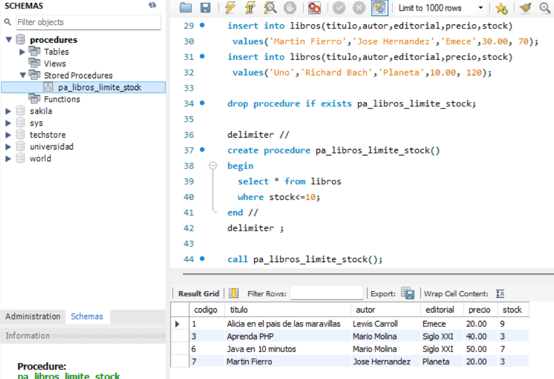
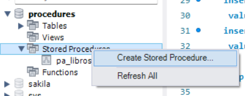
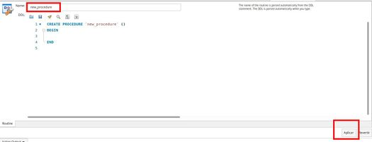
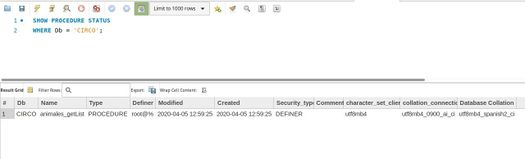
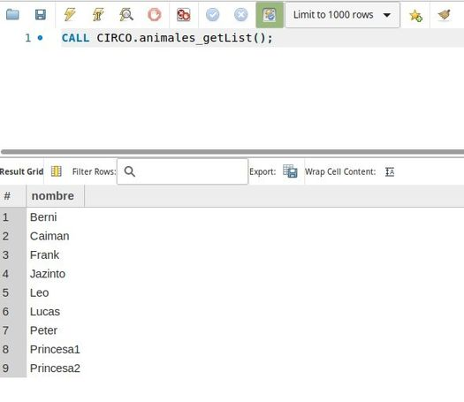
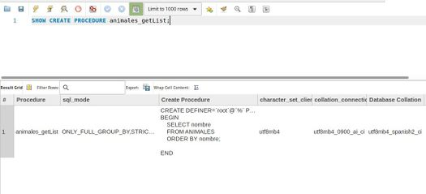

# Stored Procedures
- A stored procedure is a resource incorporated by all relational managers that allows associating a name (the procedure name) with a set of SQL instructions.
- Each time the procedure is called, all instructions are executed.
- Unlike a method in object-oriented programming, we can use SQL instructions that will be executed directly in the manager.
- Typically, when developing an application, we will have:
  - A client-side interface (i.e., the screen(s) the client uses to retrieve and perform operations on a database). This client program will be installed on each user's computer (if it's a desktop application, such as one developed with NetBeans, VC#, VB, etc.).
  - A server where the manager is installed and where the database that users access is located (usually on a single computer).
- Within the source code that makes up the client program is where we will execute the SQL commands for querying or modifying data (SELECT, UPDATE, DELETE or INSERT) as well as transactions....

---

# Stored procedures (create - execute)
The SQL command that allows you to create a stored procedure is **CREATE PROCEDURE**

The basic partial syntax is:
```sql
create procedure PROCEDURENAME()
begin
 INSTRUCTIONS;
end
```
We will gradually explore the options that the previous SQL command allows us to use.
At a minimum, we must specify a name for the procedure and a set of SQL commands between the keywords BEGIN and END.

```sql
USE  BD ;

DELIMITER  $$

CREATE  PROCEDURE  procName ()
BEGIN
        -- SQL instructions to be executed within the procedure

END $$

DELIMITER  ;
```

- A procedure is created within a specific database.
- If we do not specify the database, it will use the active database , which in MySQL Workbench is the one displayed in bold.
- When we execute the CREATE PROCEDURE command, we can first change the active database with the SQL command: `USE database_name;`
- Another way to specify which database the procedure should be created in is by preceding the procedure name with the database name followed by a period,
like this: `CREATE PROCEDURE databaseName.procName ()`

- Among the clauses we can use within the CREATE PROCEDURE would be COMMENT, which serves to document the purpose of the procedure:
```sql
USE  BD ;

DELIMITER  $$

CREATE  PROCEDURE  procName ()
COMMENT  'Objective of the procedure'
BEGIN 
        -- SQL instructions to be executed within the procedure

END $$

DELIMITER  ;
```

The first thing that stands out when you see the definition of a stored procedure in MySQL is the SQL DELIMITER command:

```sql
USE  CIRCUS ;

DELIMITER  $$

CREATE  PROCEDURE  animales_getList () 
BEGIN 
    SELECT  nombre 
    FROM  ANIMALES 
    ORDER  BY  nombre ;

END $$

DELIMITER  ;
```

MySQL uses the semicolon as the default SQL statement delimiter. This means that every time it encounters a semicolon, it attempts to execute the SQL command.
We must view the stored procedure as a whole, as if it were a single instruction that we want MySQL to execute in its entirety.
If we keep the semicolon, we would have something like this:

```sql
use  employees ;

CREATE  PROCEDURE  animals_getList () 
BEGIN

END ;
```

But what happens if we want to put an SQL command inside the stored procedure?
It will attempt to execute it and will not interpret it as part of the stored procedure.
To avoid this, we use the `SQL DELIMITER` command to specify the symbol that MySQL should find to execute the SQL command (in our case, CREATE PROCEDURE), and therefore we can then put SQL statements within it, ending in a semicolon to separate them.
When we have finished defining the stored procedure, we again indicate that the delimiter is ';' in case we want to execute other SQL instructions afterwards.

Note that the delimiter does not have to be $$; it could be any delimiter that we know will not be used within the stored procedure, such as %%.

Once created, it will appear in the Stored Procedures section in MySQL Workbench.



In MySQL Workbench we can also create it in the following way:
          **Creating stored procedures in MySQL Workbench**

             

In this case, there's no need to specify a DELIMITER, as MySQL Workbench will handle that automatically.

--- 

## List procedures
The SQL command that allows you to view information about stored procedures is: **SHOW PROCEDURE STATUS**.
For example, to view information about the stored procedures in the `CIRCO` database:
```sql
SHOW  PROCEDURE  STATUS 
WHERE  Db  =  'CIRCUS' ;
```
    

 ## Call a procedure
To call a stored procedure we must use the **SQL CALL** command .
When you call a stored procedure, the commands inside it will be executed.
For example:

```sql
CALL  CIRCUS.animals_getList ();
```

Note that the stored procedure name is preceded by the database name. This wouldn't be necessary if we were executing the procedure with the selected database or if we had the SQL command `USE db_name;` before the procedure call.

    

 ## Visualizar el código de un procedimiento
Para ver el código de un procedimiento almacenado podemos hacer uso de la orden SQL **SHOW CREATE PROCEDURE nombre_proc**

``sql
SHOW CREATE PROCEDURE animales_getList;
```

    
