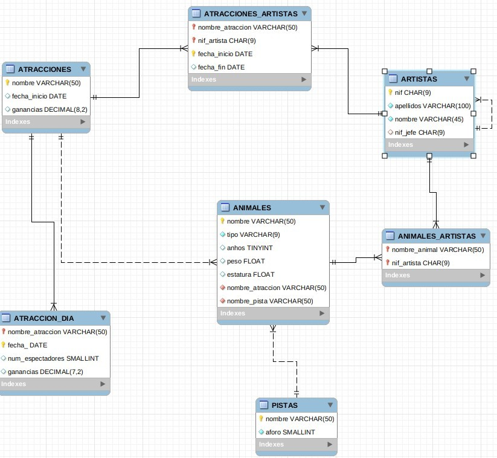

# Base de datos para ejemplo y ejercicios propuestos

Algunos ejemplos y ejercicios propuestos están basados en una base de datos de nombre `CIRCO` probado sobre un gestor MYSQL:

[Descargar CIRCO.ZIP](../assets/CIRCO.zip)

