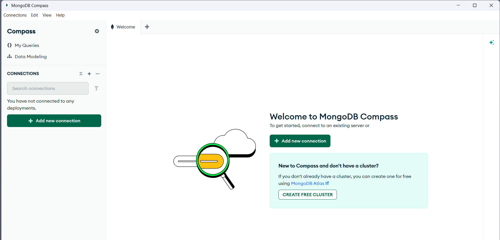
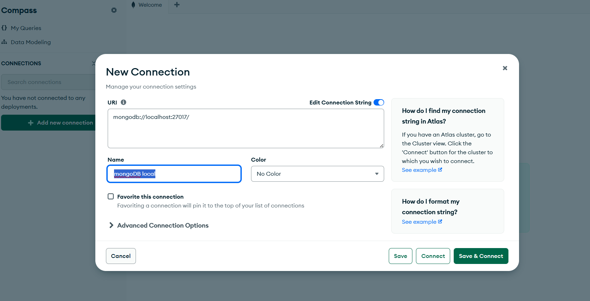
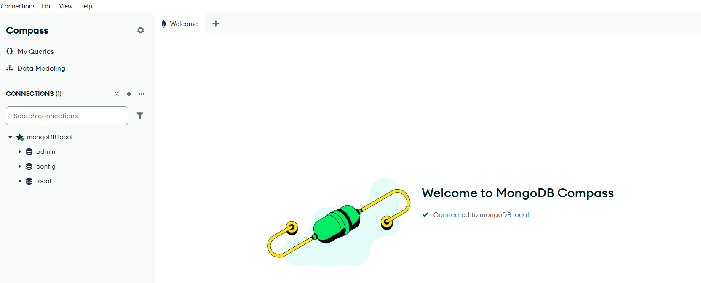

# 2. Introduction to MongoDB

To interact with MongoDB, whether to create databases, run queries, or perform other administration-related operations, you typically work with a graphical management interface. Throughout this course, we will specifically use **MongoDB Compass**, the tool recommended by the vendor.

So much so that the MongoDB installer allows you to install both MongoDB and MongoDB Compass simultaneously. MongoDB Compass is the official MongoDB graphical user interface (GUI) tool, which allows you to interact with your database visually.

This tool can be downloaded and used for free with the *Community Edition*.

> With MongoDB Compass, you can:
>
    - Visualize data: View your data structure and documents without needing code.
    - Query data: Use an intuitive query bar to filter, sort, and modify documents.
    - Analyze performance: Monitor server metrics and visualize query execution plans to optimize performance.

## 2.1 Startup and initial software configuration

Once the installation is complete, to connect to the local MongoDB instance, start MongoDB Compass by double-clicking the application shortcut icon created on the desktop during installation.

To connect to the local MongoDB server, click the ` + Add new connection ` button, and the following screen will appear where you should leave everything as default, and only edit the name you will assign to it.

We will name the connection ` MongoDB local `. Once edited, click the ` Save and Connect ` button and you will be connected to the MongoDB instance installed on your local machine.

The following figure shows the “ MongoDB local ” connection we have configured and saved, along with the databases created in this instance:

As you can see in both the previous and the following figures, in the instance we are connecting to for the first time there are three databases created: ` admin `, ` config ` and ` local `.

These three databases are automatically created during installation and have crucial internal and system functions. It is important to note that they should not be used to store application data.  
Their purpose is as follows:

- **admin**. The admin database is the most important for administration. It contains global configuration data and allows administrative tasks to be performed across the entire server. For example, to create users in the database, it must be done here. User and role commands are executed in this database and are used to manage access and security for all others.

- **config**. The config database is used in distributed cluster environments, known as sharding. It stores metadata and configuration information about the cluster, such as shard locations, data ranges, and zone configurations. In a cluster environment, this database is essential for sharding management. In a single-node local installation, this database contains little information, as sharding is not used.

- **local**. The local database is used to store replication data and is not replicated. It contains information about the state of the replica set, such as the oplog (a record of all data modification operations), which allows synchronization between members of the set. Since it is not replicated, it is ideal for data that is only relevant to the local instance.

>[!Important] 
>In summary, it is important to remember that these three databases are essential components of the MongoDB system and are fundamental for security (admin), scalability (config), and replication (local). It is crucial not to modify or delete them, as this could compromise the server’s operation.
