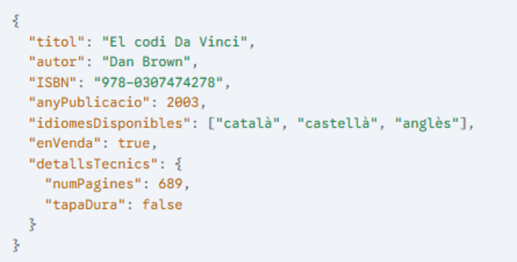
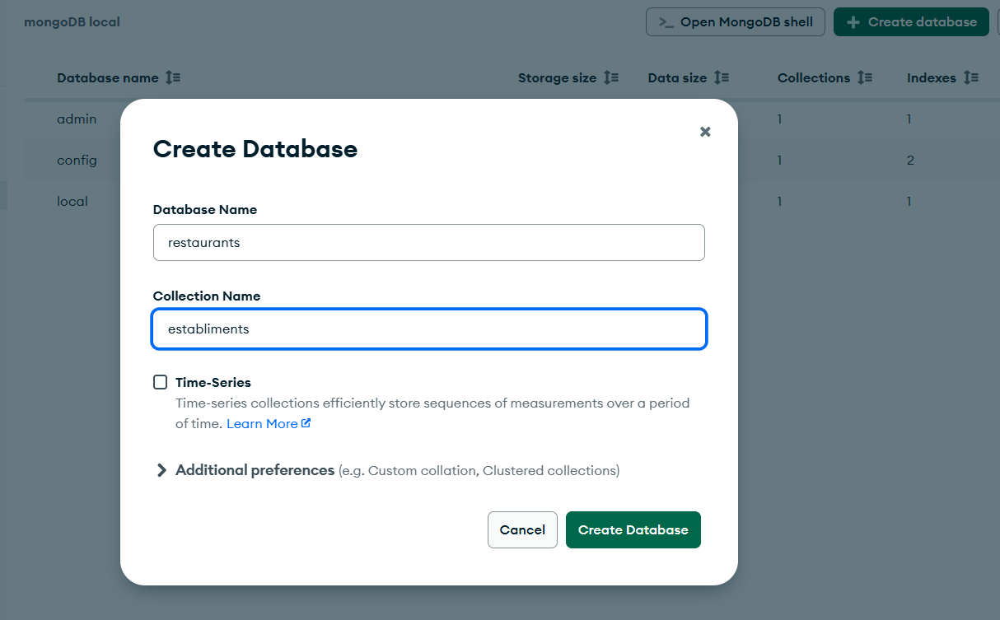
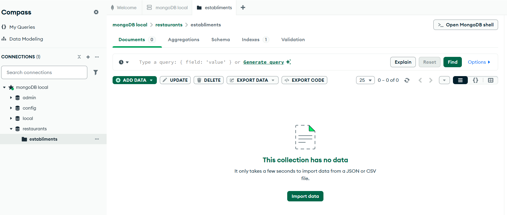
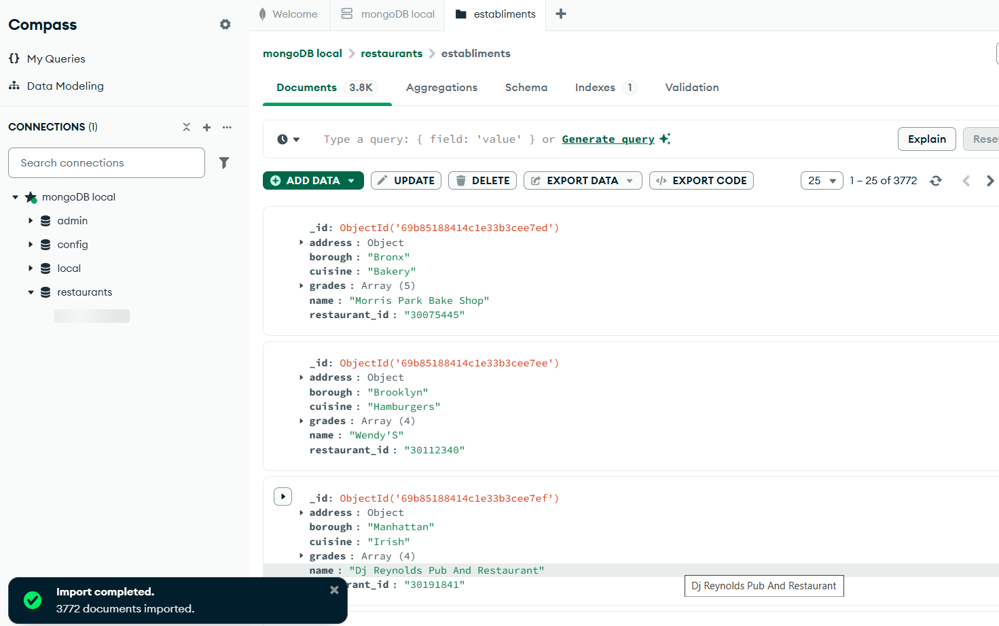

# 1. First steps in MongoDB: Database creation and data import

Once you have installed the MongoDB DBMS and its graphical administration interface—MongoDB Compass, as you already know—we will now see how to create a database and how to import data into it.

The data will be stored in plain text files containing a set of JSON documents, which we will learn how to import.

A JSON document is a data structure that uses key-value pairs and can include nested objects and arrays. It is the main format used by document-oriented databases such as MongoDB. MongoDB stores them internally in a binary format, and once imported, they are called BSON documents (Binary JSON).


> **JSON vs BSON**
>
> JSON is the communication format we use when interacting with the database  
> (for example, when running queries in MongoDB Compass). BSON, on the other hand,  
> is the internal format that MongoDB uses to store and manage data efficiently.  
> The MongoDB software handles the translation between JSON and BSON transparently  
> for the user.




The JSON document shown in the previous figure describes a book. It has a hierarchical structure based on key-value pairs.


> **Description of the parts of the JSON document**
>
> The description of the parts of the JSON document shown in Figure 15 is as follows:
>
> - {…}: These braces indicate the beginning and end of a JSON object. It is the main data unit.
> - *title, author, ISBN, publicationYear*: These are keys of the object. Each one identifies a specific value. Their corresponding values are “The Da Vinci Code”, “Dan Brown”, “978-0307474278”, and 2003.
> - *availableLanguages*: This key has an array value, indicated by square brackets […]. An array is an ordered list of values. In this case, the list contains three strings: "Catalan", "Spanish", and "English".
> - *forSale*: This key has a boolean value, which can be true or false.
> - *technicalDetails*: This key has a value that is another JSON object, with its own keys and values:
>   - *numPages*: A key with a numeric value (689).
>   - *hardcover*: A key with a boolean value (false).


## 1.1 Database Creation
To create a database, the first step is to open MongoDB Compass and connect to the local instance.

Once connected to the local MongoDB instance, you will see a list of existing databases (admin, config, local). To create a new one, click the + Create database button located at the top of the screen.

After clicking this button, a dialog box will appear asking for the name of the database to be created and the name of its first collection.

In our case, we will enter `restaurants` as the database name and `establishments` as the collection name. Then, click the `Create Database` button.



As you can see in the image, the restaurants database has already been created, along with its first—and for now only—collection, `establishments`, which, as expected, is currently empty.



## 1.2 Data Import

To import data into a collection in a database, we will download the `restaurants.json` file and copy it to a location that is easily accessible.

[Download restaurants.json](./BBDD/restaurants.json)

Click on the `establishments` collection, and once you do, you will see the Import Data button appear. Click on this button to perform the import.

Once all the data has been imported, as shown in the image, you will be able to see the first documents in the collection.



All the previous steps can also be performed using the command line (shell). To do this, click the `>_ Open MongoDB Shell` button, as shown in the image.

When you click this button, a terminal window will open with `mongosh`, already connected to the instance you were managing, making it easier to execute commands.

You can verify that everything is working correctly by typing the following commands:

```shell
use restaurants

db.establishments.countDocuments();
```

With the first instruction, `use restaurants`, we have switched to the restaurants database.

With the second, `db.establishments.countDocuments()`, we asked MongoDB how many documents are in the establishments collection, and it returned 3772.
