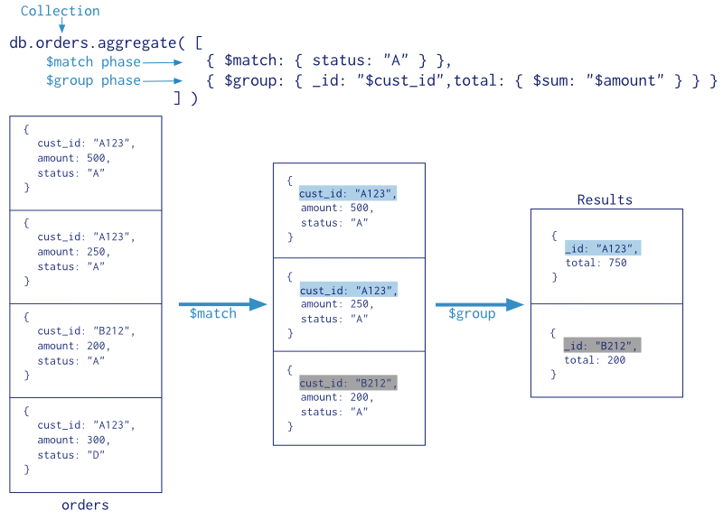

# Aggregation Pipeline

When working with large volumes of data, it's often necessary to transform, combine, and filter it for analysis or to obtain a summary. MongoDB's aggregation framework is a powerful tool that facilitates these tasks. It allows us to perform complex queries, process, and transform the data extracted from collections.

An aggregation pipeline consists of one or more stages that process documents sequentially.

Once an aggregation pipeline is started, MongoDB's query optimizer analyzes it for efficient execution. The execution engine extracts documents from the collection and sends them through the pipeline.

Each stage performs a specific operation on the received documents, such as performing calculations or sorting data. Once a stage's operation is complete, the processed documents are passed to the next stage, and the process continues until all stages are finished and the final result is obtained.

Aggregations use a pipeline, known as **Aggregation Pipeline**, hence the aggregate method uses an array with [ ] where each element is a phase of the pipeline, so that the output of one phase is the input of the next.

```javascript
db.coleccion.aggregate([fase1, fase2, ... faseN])
```
![Note]
MongoDB offers multiple aggregation stages, including:

**$match:** Filters documents that meet specific criteria. If this stage is the first, it optimizes execution by reducing the amount of data that subsequent stages must process. It can also leverage indexes to improve performance.

**$sort:** Sorts the documents received by the pipeline according to the specified fields, either ascending or descending. This stage can leverage an index if placed at the beginning of the pipeline.

**$limit:** Restricts the number of documents that pass to the next stage or to the final result. It makes sense to use it right after a sorting stage.

**$group:** Groups documents according to a key. It is very useful for performing calculations or operations on the grouped data, such as sums, averages, or counters.

**$lookup:** Performs a left outer join to incorporate related data from another collection, similar to how it is done in SQL.

**$unwind:** Unwinds an array field in a document, generating a new document for each element of the array. In other words, it separates the data within an array.

**$project:** Projects fields, that is, properties we are interested in. It also allows us to modify a document or create a subdocument (reshape).

The following image summarizes the steps of a grouping operation: first, the elements to be grouped are selected using `$match`, the resulting elements are grouped with `$group`, and finally, the total is calculated for the grouped elements using `$sum`:



When creating a pipeline, we divide queries into phases, where each phase uses an operator to perform a transformation. Although there's no limit to the number of phases in a query, it's important to note that order matters, and there are optimizations to help the pipeline perform better (for example, using `$match` at the beginning to reduce the amount of data).

## Pipeline Operators
First of all, it's worth noting that phases can be repeated, so a query can repeat operators to chain different actions.

To explain the next section, let's work with a collection of products whose document has the following structure:

```json
[{
  "_id": {
    "$oid": "69e63239fe5bb77e1ca5bd82"
  },
  "nombre": "iPad 16GB Wifi",
  "fabricante": "Apple",
  "categoria": "Tablets",
  "precio": 499
},
{
  "_id": {
    "$oid": "69e63239fe5bb77e1ca5bd83"
  },
  "nombre": "iPad 32GB Wifi",
  "categoria": "Tablets",
  "fabricante": "Apple",
  "precio": 599
},
{
  "_id": {
    "$oid": "69e63239fe5bb77e1ca5bd84"
  },
  "nombre": "iPad 64GB Wifi",
  "categoria": "Tablets",
  "fabricante": "Apple",
  "precio": 699
},
{
  "_id": {
    "$oid": "69e63239fe5bb77e1ca5bd85"
  },
  "nombre": "Galaxy S3",
  "categoria": "Smartphones",
  "fabricante": "Samsung",
  "precio": 563.99
},
{
  "_id": {
    "$oid": "69e63239fe5bb77e1ca5bd86"
  },
  "nombre": "Galaxy Tab 10",
  "categoria": "Tablets",
  "fabricante": "Samsung",
  "precio": 450.99
},
{
  "_id": {
    "$oid": "69e63239fe5bb77e1ca5bd87"
  },
  "nombre": "Vaio",
  "categoria": "Portátiles",
  "fabricante": "Sony",
  "precio": 499
},
{
  "_id": {
    "$oid": "69e63239fe5bb77e1ca5bd88"
  },
  "nombre": "Macbook Air 13inch",
  "categoria": "Portátiles",
  "fabricante": "Apple",
  "precio": 499
},
{
  "_id": {
    "$oid": "69e63239fe5bb77e1ca5bd89"
  },
  "nombre": "Nexus 7",
  "categoria": "Tablets",
  "fabricante": "Google",
  "precio": 199
},
{
  "_id": {
    "$oid": "69e63239fe5bb77e1ca5bd8a"
  },
  "nombre": "Kindle Paper White",
  "categoria": "Tablets",
  "fabricante": "Amazon",
  "precio": 129
},
{
  "_id": {
    "$oid": "69e63239fe5bb77e1ca5bd8b"
  },
  "nombre": "Kindle Fire",
  "categoria": "Tablets",
  "fabricante": "Amazon",
  "precio": 199
}]
```

### $match

The $match operator is primarily used to filter which documents will proceed to the next stage of the pipeline or to the final output.

For example, to select only tablets, we would do the following:
```javascript
db.productos.aggregate([{$match:{categoria:"Tablets"}}])
```
It is recommended to place the `$match` operator at the beginning of the pipeline to limit the documents processed in subsequent phases. Using this operator as the first phase allows us to efficiently utilize the collection's indexes.

Therefore, to obtain the number of tablets priced under €500 that each company owns, we would do the following:

```javascript
 db.productos.aggregate([
    {$match:
      {categoria:"Tablets",
      precio: {$lt: 500}}},
    {$group:
      {_id: {"empresa":"$fabricante"},
      cantidad: {$sum:1}}
    }
  ])
 { _id: { empresa: 'Samsung' }, cantidad: 1 }
  { _id: { empresa: 'Amazon' }, cantidad: 2 }
  { _id: { empresa: 'Google' }, cantidad: 1 }
  { _id: { empresa: 'Apple' }, cantidad: 1 }
```

### $sort
The $sort operator sorts the received documents by the specified field, and the order is determined by the expression passed to the pipeline.

For example, to sort products by price in descending order, we would do the following:

```javascript
db.productos.aggregate({$sort:{precio:-1}})
```
The `$sort` operator sorts the data in memory, so you need to be careful with the size of the data. Therefore, it's used in the later stages of the pipeline, when the result set is as small as possible.

If we return to the previous example and sort the data by total price, we get:

```javascript
 db.productos.aggregate([
    {$match:{categoria:"Tablets"}},
    {$group:
      {_id: {"empresa":"$fabricante"},
      totalPrecio: {$sum:"$precio"}}
    },
    {$sort:{totalPrecio:-1}}   
  ])
  { _id: { empresa: 'Apple' }, totalPrecio: 1797 }
  { _id: { empresa: 'Samsung' }, totalPrecio: 450.99 }
  { _id: { empresa: 'Amazon' }, totalPrecio: 328 }
  { _id: { empresa: 'Google' }, totalPrecio: 199 }
```
A closely related operator is `$sortByCount`. This operator is similar to performing the following operations:

```javascript
{ $group: { _id: <expresion>, cantidad: { $sum: 1 } } },
{ $sort: { cantidad: -1 } }
```
Therefore, we can rewrite the query we made in the $group operator:

```javascript
db.productos.aggregate([
  { $group: {
      _id: "$fabricante",
      total: { $sum:1 }
    }
  },
  {$sort: {"total": -1}}
])
```
And make it with:

```javascript
db.productos.aggregate([{ $sortByCount: "$fabricante"}])
```

### $skip and $limit
The `$limit` operator simply limits the number of documents that pass through the pipeline.

The operator takes a number as a parameter:

```javascript
db.productos.aggregate([{$limit:3}])
```
The order in which we use these operators matters a lot, since it's not the same to jump and then limit, where the number of elements is fixed by `$limit`:

```javascript
 db.productos.aggregate([{$skip:2}, {$limit:3}])
 { _id: ObjectId("635194b32e6059646a8e7fee"),
    nombre: 'iPad 64GB Wifi',
    categoria: 'Tablets',
    fabricante: 'Apple',
    precio: 699 }
  { _id: ObjectId("635194b32e6059646a8e7fef"),
    nombre: 'Galaxy S3',
    categoria: 'Smartphones',
    fabricante: 'Samsung',
    precio: 563.99 }
  { _id: ObjectId("635194b32e6059646a8e7ff0"),
    nombre: 'Galaxy Tab 10',
    categoria: 'Tablets',
    fabricante: 'Samsung',
    precio: 450.99 }
```
On the other hand, if we first limit and then jump, the number of elements is obtained from the difference between the limit and the jump:

```javascript
 db.productos.aggregate([{$limit:3}, {$skip:2}])
 { _id: ObjectId("635194b32e6059646a8e7fee"),
    nombre: 'iPad 64GB Wifi',
    categoria: 'Tablets',
    fabricante: 'Apple',
    precio: 699 }
```
[!Info] **$sample**

If we have a very large dataset and want to test queries with a small number of documents, we can use the `$sample` operator to randomly reduce the number of documents:

```javascript
db.productos.aggregate([ { $sample: { size: 3 } } ])
```

### $group

To separate documents into groups based on a "group key," the `$group` operator is used. The result is one document for each unique group key, similar to `group by` in SQL.

[!Note] Caution:
> The output of `$group` is unsorted.

In the following example, to reference a product manufacturer, we will use `$manufacturer`, creating a total field that uses `$sum` as an accumulator and adds one unit for each manufacturer found:

```javascript
 db.productos.aggregate([
  { $group: {
      _id: "$fabricante",
      total: { $sum:1 }
    }
  }])
 { _id: 'Apple', total: 4 }
  { _id: 'Samsung', total: 2 }
  { _id: 'Sony', total: 1 }
  { _id: 'Google', total: 1 }
  { _id: 'Amazon', total: 2 }
```

If we want the identifier value to contain an object, we can do so by associating it as a value:

```javascript
 db.productos.aggregate([
  { $group: {
      _id: { "empresa": "$fabricante" },
      total: { $sum:1 }
    }
  }])

  { _id: { empresa: 'Sony' }, total: 1 }
  { _id: { empresa: 'Apple' }, total: 4 }
  { _id: { empresa: 'Google' }, total: 1 }
  { _id: { empresa: 'Samsung' }, total: 2 }
  { _id: { empresa: 'Amazon' }, total: 2 }
```

We can also group more than one attribute, so that we have a composite _id. For example:

```javascript
 db.productos.aggregate([
  { $group: {
      _id: {
        "empresa": "$fabricante",
        "tipo": "$categoria" },
      total: {$sum:1}
    }
  }])
 { _id: { empresa: 'Apple', tipo: 'Tablets' }, total: 3 }
  { _id: { empresa: 'Sony', tipo: 'Portátiles' }, total: 1 }
  { _id: { empresa: 'Apple', tipo: 'Portátiles' }, total: 1 }
  { _id: { empresa: 'Samsung', tipo: 'Smartphones' }, total: 1 }
  { _id: { empresa: 'Amazon', tipo: 'Tablets' }, total: 2 }
  { _id: { empresa: 'Google', tipo: 'Tablets' }, total: 1 }
  { _id: { empresa: 'Samsung', tipo: 'Tablets' }, total: 1 }
```

[!Important] Always _id
>Every expression in `$group` must specify an `_id` field.

**Common Aggregation Operators**

Within the `$group` stage, MongoDB offers various operators for efficiently performing calculations and summarizing data. The most commonly used are:

- **$sum:** Calculates the total sum of the values ​​in a numeric field. For example, `$sum : “$quantity”` would sum all the quantities.

- **$avg:** Calculates the arithmetic mean of the values ​​in a field. For example, `$avg : “$score”` would calculate the average score.

- **$min:** Finds the minimum value of a field in the group.

- **$max:** Finds the maximum value of a field in the group.

- **$first:** Gets the value of the first document in the group (based on the order in which they are processed).

**$first:** - **$last:** Gets the value of the last document in the group (according to the order in which they are processed).

- **$push:** Creates an array of all the values ​​of a field for each document in the group.

- **$count:** Counts the number of documents in each group. (This can also be done with $sum : 1).

For example, to get the total amount of products grouped by manufacturer, we would do the following:

```javascript
 db.productos.aggregate([{
    $group: {
      _id: {
        "empresa": "$fabricante"
      },
      totalPrecio: {$sum:"$precio"}
    }
  }])
 { _id: { empresa: 'Apple' }, totalPrecio: 2296 }
  { _id: { empresa: 'Samsung' }, totalPrecio: 1014.98 }
  { _id: { empresa: 'Sony' }, totalPrecio: 499 }
  { _id: { empresa: 'Google' }, totalPrecio: 199 }
  { _id: { empresa: 'Amazon' }, totalPrecio: 328 }
```

To obtain the average price of products grouped by category, we would do the following:

```javascript
 db.productos.aggregate([{
    $group: {
      _id: {
        "categoria":"$categoria"
      },
      precioMedio: {$avg:"$precio"}
    }
  }])
 { _id: { categoria: 'Smartphones' }, precioMedio: 563.99 }
  { _id: { categoria: 'Portátiles' }, precioMedio: 499 }
  { _id: { categoria: 'Tablets' }, precioMedio: 396.4271428571428 }
```
To obtain the categories in which each company has products, we would do the following:

```javascript
 db.productos.aggregate([{
    $group: {
      _id: {
      "fabricante":"$fabricante"
      },
      categorias: {$addToSet:"$categoria"}
    }
  }])
  { _id: { fabricante: 'Apple' }, categorias: [ 'Portátiles', 'Tablets' ] }
  { _id: { fabricante: 'Amazon' }, categorias: [ 'Tablets' ] }
  { _id: { fabricante: 'Sony' }, categorias: [ 'Portátiles' ] }
  { _id: { fabricante: 'Google' }, categorias: [ 'Tablets' ] }
  { _id: { fabricante: 'Samsung' }, categorias: [ 'Tablets', 'Smartphones' ] }
```

### $unwind
The `$unwind` operator is very interesting and is used only with array operators. When used with an array field of size N in a document, it transforms it into N documents, with the field taking the individual value of each element in the array.

Consider the following example where we have a collection of links, and we have a link with the following information:

```javascript
 db.enlaces.findOne()
 { _id: ObjectId("635533668420cd585aac88f3"),
    titulo: 'www.google.es',
    tags: [ 'mapas', 'videos', 'blog', 'calendario', 'email', 'mapas' ] }
```
We can see that the tags field contains 6 values ​​within the array (with one repeated value). Next, we will destructure the array:

```javascript
 db.enlaces.aggregate([
  {$match:{titulo:"www.google.es"}},
  {$unwind:"$tags"}
])
 { _id: ObjectId("635533668420cd585aac88f3"),
    titulo: 'www.google.es', tags: 'mapas' }
  { _id: ObjectId("635533668420cd585aac88f3"),
    titulo: 'www.google.es', tags: 'videos' }
  { _id: ObjectId("635533668420cd585aac88f3"),
    titulo: 'www.google.es', tags: 'blog' }
  { _id: ObjectId("635533668420cd585aac88f3"),
    titulo: 'www.google.es', tags: 'calendario' }
  { _id: ObjectId("635533668420cd585aac88f3"),
    titulo: 'www.google.es', tags: 'email' }
  { _id: ObjectId("635533668420cd585aac88f3"),
    titulo: 'www.google.es', tags: 'mapas' }
```
Therefore, we have obtained 6 documents with the same _id and title, that is, one document per element in the array.

In this way, we can perform queries that sum/count the elements in the array. For example, if we want to obtain the 3 tags that appear most frequently in all the links, we would do the following:

```javascript
 db.enlaces.aggregate([
  {"$unwind":"$tags"},
  {"$group":
   {"_id":"$tags",
    "total":{$sum:1}
   }
  },
  {"$sort":{"total":-1}},
  {"$limit": 3}
])
 { _id: 'mapas', total: 2 }
  { _id: 'blog', total: 1 }
  { _id: 'calendario', total: 1 }
```
### Double $unwind
If we're working with documents that have multiple arrays, we might need to unwind both arrays. A double unwind creates a Cartesian product between the elements of the two arrays.

Suppose we have the following clothing inventory data:

```javascript
 db.inventario.drop();
 db.inventario.insertOne({'nombre':"Camiseta",
                           'tallas':["S", "M", "L"],
                           'colores':['azul', 'blanco', 'naranja', 'rojo']})
 db.inventario.insertOne({'nombre':"Jersey",
                           'tallas':["S", "M", "L", "XL"],
                           'colores':['azul', 'negro', 'naranja', 'rojo']})
 db.inventario.insertOne({'nombre':"Pantalones",
                           'tallas':["32x32", "32x30", "36x32"],
                           'colores':['azul', 'blanco', 'naranja', 'negro']})
```
To obtain a list of the quantity of pairs in size/color, we would do the following:

```javascript
 db.inventario.aggregate([
  {$unwind: "$tallas"},
  {$unwind: "$colores"},
  {$group:
    { '_id': {'talla': '$tallas', 'color': '$colores'},
    'total' : {'$sum': 1}
    }
  }
])
{ "_id" : { "talla" : "XL", "color" : "rojo" }, "total" : 1 }
{ "_id" : { "talla" : "XL", "color" : "negro" }, "total" : 1 }
{ "_id" : { "talla" : "L", "color" : "negro" }, "total" : 1 }
{ "_id" : { "talla" : "M", "color" : "negro" }, "total" : 1 }
...
```

### $lookup
If we need to join the data from two collections, we will use the `$lookup` operator, which performs a left outer join on a collection from the same database to filter the documents from the joined collection.

The result is a new array field for each input document, containing the documents that meet the join criteria.

The `$lookup` operator uses four parameters:

- from: the collection with which the join is performed.

- localField: a field in the source collection, the one from the aggregation db.origen.aggregate, which acts as the foreign key.

- foreignField: a field in the collection specified in from that allows the join (this would be the primary key of the collection on which the join is performed).

- as: the name of the array that will contain the linked documents.

We will use the following collections: a `zips` collection that has a structure similar to:

```json
{ _id: ObjectId("5c8eccc1caa187d17ca6ed18"),
  city: 'ACMAR',
  zip: '35004',
  loc: { y: 33.584132, x: 86.51557 },
  pop: 6055,
  state: 'AL' }
```

And another collection called `state` with the names of the states:

```json
[{
  "_id": {
    "$oid": "69e6396a67fa6ace03e42d18"
  },
  "name": "Alabama",
  "abbreviation": "AL"
},
{
  "_id": {
    "$oid": "69e6396a67fa6ace03e42d19"
  },
  "name": "Alaska",
  "abbreviation": "AK"
},
{
  "_id": {
    "$oid": "69e6396a67fa6ace03e42d1a"
  },
  "name": "American Samoa",
  "abbreviation": "AS"
},
{
  "_id": {
    "$oid": "69e6396a67fa6ace03e42d1b"
  },
  "name": "Arizona",
  "abbreviation": "AZ"
},
{
  "_id": {
    "$oid": "69e6396a67fa6ace03e42d1c"
  },
  "name": "Arkansas",
  "abbreviation": "AR"
},
```

Let's analyze how the $lookup operator works using an example. First, let's retrieve the three most populated states. To do this, we could use the following aggregate query:

```javascript
db.zips.aggregate([
  {$group: {
      _id: "$state",
      "totalPoblacion": {$sum:"$pop"}
  }},
  {$sort:{"totalPoblacion":-1}} ,
  {$limit: 3}  
])
```

If we now want to recover the names of those three states, we add a new phase:

```javascript
db.zips.aggregate([
  {$group: {
      _id: "$state",
      "totalPoblacion": {$sum:"$pop"}
  }},
  {$sort:{"totalPoblacion":-1}} ,
  {$limit: 3},
  {$lookup: {
    from: "states",
    localField: "_id",
    foreignField: "abbreviation",
    as: "estados"
  }},    
])
```
For each document, we obtain an array with the matching documents (in this case it is a 1:1 relationship, and therefore each array only contains one element):

```javascript
{ _id: 'CA',
  totalPoblacion: 29760021,
  estados: 
   [ { _id: ObjectId("63565cd82889ecee358e0cd5"),
       name: 'California',
       abbreviation: 'CA' } ] }
{ _id: 'NY',
  totalPoblacion: 17990455,
  estados: 
   [ { _id: ObjectId("63565cd82889ecee358e0cf4"),
       name: 'New York',
       abbreviation: 'NY' } ] }
{ _id: 'TX',
  totalPoblacion: 16986510,
  estados: 
   [ { _id: ObjectId("63565cd82889ecee358e0d02"),
       name: 'Texas',
       abbreviation: 'TX' } ] }
```

Since the relationship will always cause the creation of an array, we can undo it using `$unwind`:

```javascript
db.zips.aggregate([
  {$group: {
      _id: "$state",
      "totalPoblacion": {$sum:"$pop"}
  }},
  {$sort:{"totalPoblacion":-1}} ,
  {$limit: 3},
  {$lookup: {
    from: "states",
    localField: "_id",
    foreignField: "abbreviation",
    as: "estados"
  }},    
  {$unwind:"$estados"}
])
```
Therefore, to finally obtain the name of each state, we retrieve the name field using $project:

```javascript
db.zips.aggregate([
  {$group: {
      _id: "$state",
      "totalPoblacion": {$sum:"$pop"}
  }},
  {$sort:{"totalPoblacion":-1}} ,
  {$limit: 3},
  {$lookup: {
    from: "states",
    localField: "_id",
    foreignField: "abbreviation",
    as: "estados"
  }},
  {$unwind:"$estados"},  
  {$project: {
    "estado": "$estados.name",
    "poblacion": "$totalPoblacion"
  }}    
])
```
Obtaining the desired result:

```json
{ _id: 'CA', estado: 'California', poblacion: 29760021 }
{ _id: 'NY', estado: 'New York', poblacion: 17990455 }
{ _id: 'TX', estado: 'Texas', poblacion: 16986510 }
```

### $project
If we want to project onto the result set and keep a subset of the fields, we use the `$project` operator. The result will be the same number of documents, in the order specified in the projection.

Projection within the aggregation framework is much more powerful than in regular queries. It is used to:

- Rename fields.

- Add calculated fields to the resulting document using $add, $subtract, $multiply, $divide, or $mod.
- Convert fields to uppercase ($toUpper) or lowercase ($toLower), concatenate fields using $concat, or - Obtain substrings with $substr.

- Transform fields based on values ​​obtained from a condition using logical expressions with the comparison operators seen in queries.

Example:

```javascript
> db.productos.aggregate([
  {$project:
    {
      _id: 0, //Ocultamos el campo _id
      "empresa": { "$toUpper": "$fabricante" }, //Transforma un campo y lo pasa a mayúsculas
      "detalles": { //Crea un documento anidado
        "categoria": "$categoria",
        "precio": { "$multiply": ["$precio", 1.1] } //Incrementa el precio el 10%
      },
      "elemento": "$nombre" //Renombra el campo
    }
  }
])
< { empresa: 'APPLE',
    detalles: { categoria: 'Tablets', precio: 548.9000000000001 },
    elemento: 'iPad 16GB Wifi' }
  { empresa: 'APPLE',
    detalles: { categoria: 'Tablets', precio: 658.9000000000001 },
    elemento: 'iPad 32GB Wifi' }
  ...
```

[!Important] **$set and $unset**
> Since MongoDB 4.2, we can use `$set` and `$unset` as an alternative to `$project`, which in some cases simplifies the code, for example, if we only want to add or remove fields from the result of a pipeline stage:

```javascript
db.productos.aggregate([{
  $group: {
    _id: {
      "empresa":"$fabricante"
    },
    categorias: {$push:"$categoria"}
  }},
  {$set: {
    _id: "$_id.empresa",
    cant_categorias: { $size: "$categorias"}
  }},
  {$unset: "categorias"}
])

  [
    { _id: 'Sony', cant_categorias: 1 },
    { _id: 'Amazon', cant_categorias: 2 },
    { _id: 'Google', cant_categorias: 1 },
    { _id: 'Samsung', cant_categorias: 2 },
    { _id: 'Apple', cant_categorias: 3 }
  ]
```